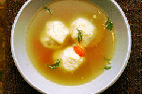

# Matzo Ball Soup

There are two matzo ball camps: those that like them heavy and leaden at the bottom of a bowl and those that like them light and fluffy–these are the latter, and in my mind, the better ones.

If you can’t find matzo meal, pulse a few pieces of matzo in your food processor until it is a coarse powder. If you can’t find matzo, well, you obviously do not live in New York City.

*Makes 8 to 12 matzo balls*

## Ingredients

### Matzo Balls
1/2 cup matzo meal
2 eggs, lightly beaten
2 tablespoons reserved chicken fat or vegetable oil
1 teaspoon salt
1/4 teaspoon black pepper
2 tablespoons chicken stock or seltzer (which both of our mothers swear by for making the balls extra light)

### For soup
2 to 3 quarts prepared chicken stock (recipe above)
1 carrot, thinly sliced
A few sprigs of dill

---

## Directions

Mix all matzo ball ingredients in a bowl. Cover and place in the refrigerator for 30 minutes.

Bring 1 1/2 quarts of well-salted water to a brisk boil in a medium sized pot.

Reduce the flame. Run your hands under water so they are thoroughly wet. Form matzo balls by dropping spoonfuls of matzo ball batter approximately 1-inch in diameter into the palm of your wet hands and rolling them loosely into balls. Drop them into the simmering salt water one at a time. Cover the pot and cook them for 30 to 40 minutes.

About ten minutes before the matzo balls are ready, bring prepared chicken stock to a simmer with the sliced carrot in it. Ladle some soup and a couple matzo balls into each bowl and top with a couple snips of dill. Eat immediately.

---

## Resources

Lightly adapted from Deb's recipe on [Smitten Kitchen](http://smittenkitchen.com/blog/2008/02/matzo-ball-soup/ "Matzo Ball Soup").
